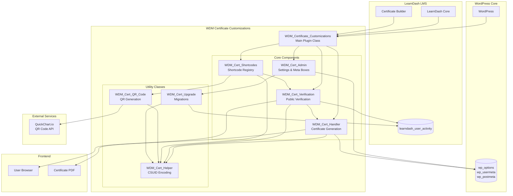
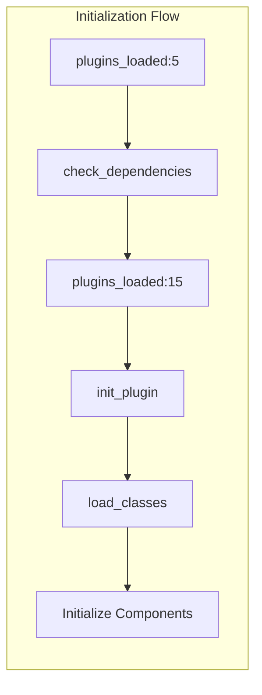
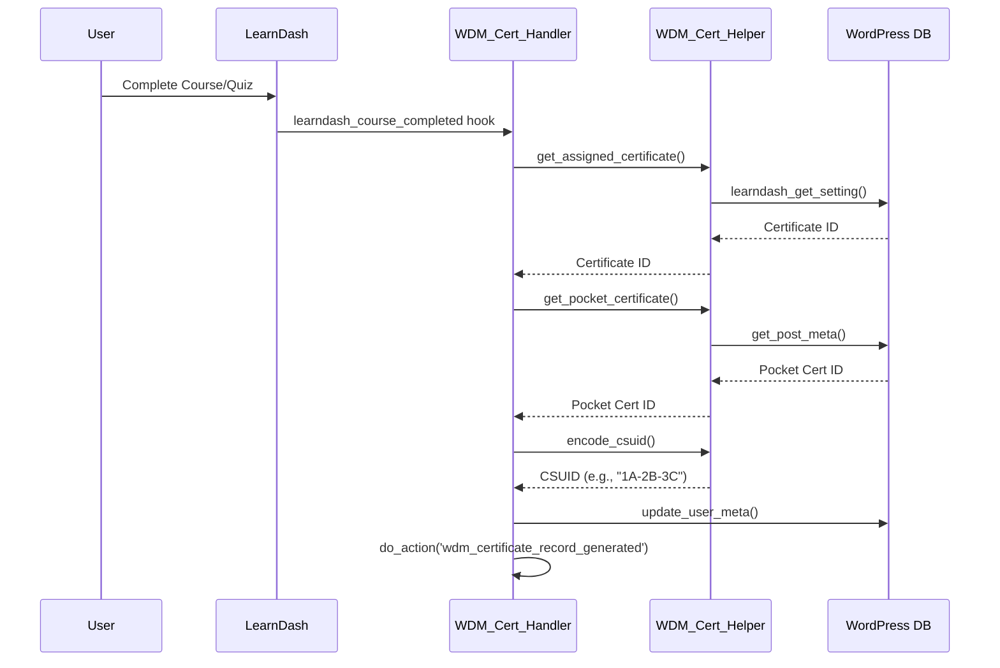
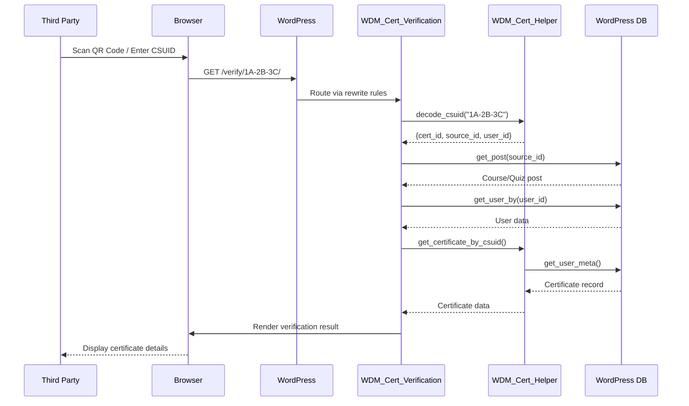
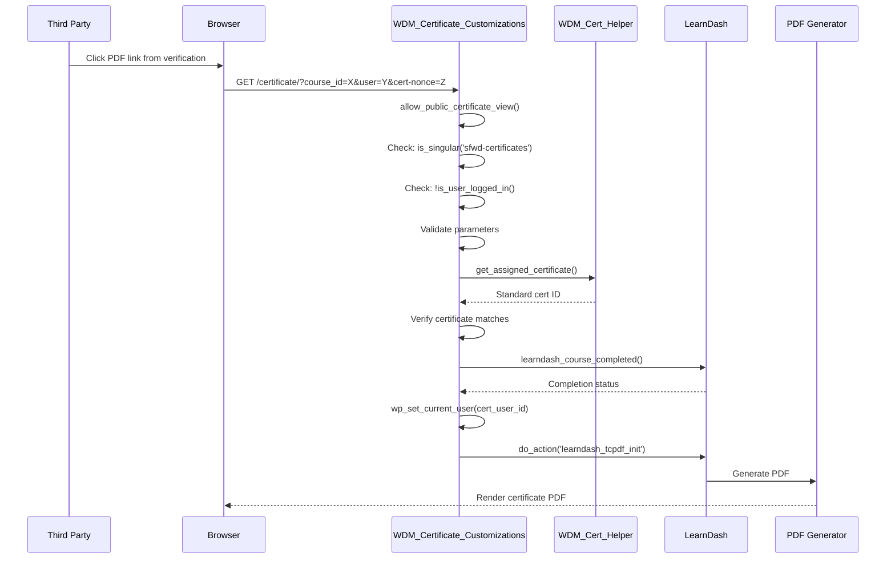
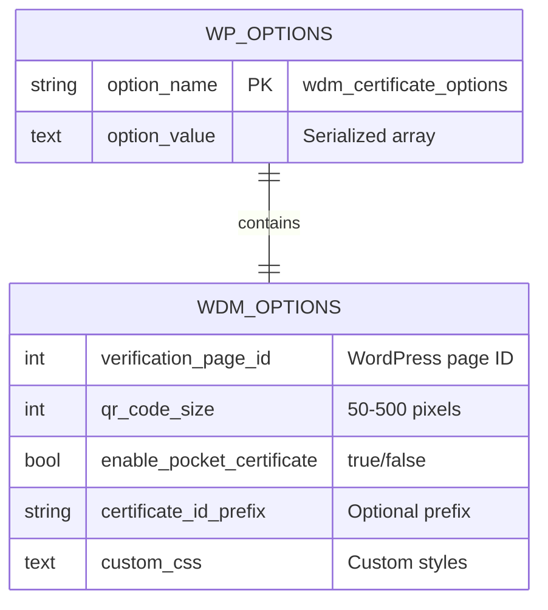
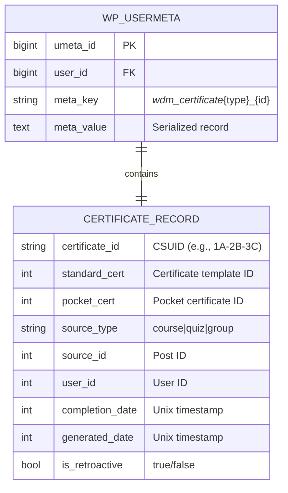
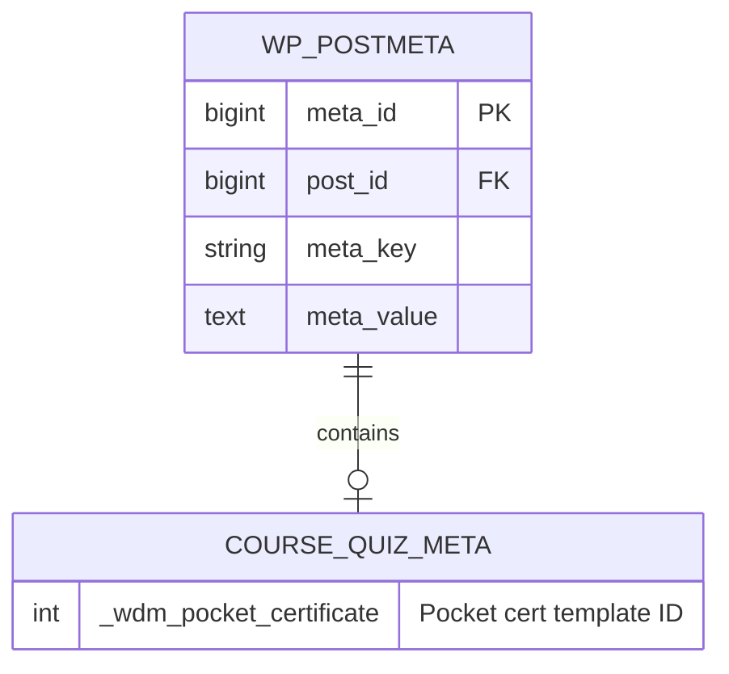
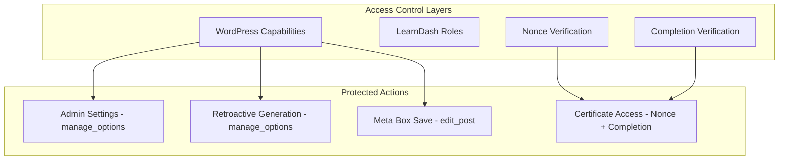
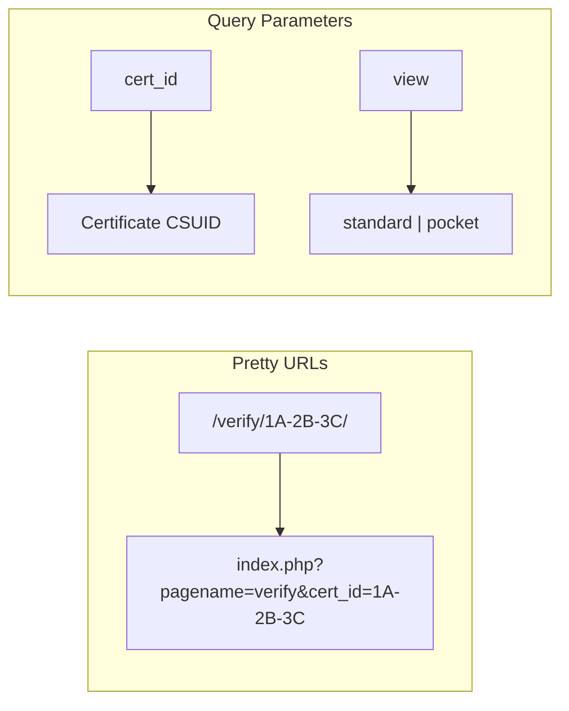

# WDM Certificate Customizations - Architecture Documentation

## Overview

WDM Certificate Customizations is a WordPress plugin that extends LearnDash LMS with dual certificate support (Standard + Pocket/Wallet Size) and a built-in QR code verification system. This document provides a comprehensive overview of the system architecture.

---

## 1. High-Level Architecture



---

## 2. Component Architecture

### 2.1 Main Plugin Class

**File:** `wdm-certificate-customizations.php`
**Class:** `WDM_Certificate_Customizations`
**Pattern:** Singleton

The main plugin class serves as the orchestrator for all plugin functionality. It:

1. Manages plugin lifecycle (activation, deactivation)
2. Checks dependencies (LearnDash, Certificate Builder)
3. Initializes all component classes
4. Registers global hooks for certificate access control
5. Enqueues frontend and admin assets



### 2.2 Admin Component

**File:** `includes/class-admin.php`
**Class:** `WDM_Cert_Admin`
**Pattern:** Singleton

Responsibilities:
- Settings page under LearnDash menu
- Course/Quiz meta boxes for pocket certificate assignment
- AJAX handler for retroactive certificate generation
- Settings sanitization and validation

### 2.3 Certificate Handler

**File:** `includes/class-certificate-handler.php`
**Class:** `WDM_Cert_Handler`
**Pattern:** Singleton

Responsibilities:
- Listen to LearnDash completion events
- Generate certificate records with CSUIDs
- Store records in user meta
- Modify certificate links to include CSUIDs

### 2.4 Verification Component

**File:** `includes/class-verification.php`
**Class:** `WDM_Cert_Verification`
**Pattern:** Singleton

Responsibilities:
- Register rewrite rules for pretty URLs
- AJAX handler for certificate verification
- Render verification results
- Handle query variables

### 2.5 Shortcodes Component

**File:** `includes/class-shortcodes.php`
**Class:** `WDM_Cert_Shortcodes`
**Pattern:** Singleton

Responsibilities:
- Register all plugin shortcodes
- Render verification form and results
- Generate QR codes for certificates
- Display certificate IDs and verification URLs

### 2.6 Helper Class

**File:** `includes/class-helper.php`
**Class:** `WDM_Cert_Helper`
**Pattern:** Static Utility

Responsibilities:
- CSUID encoding/decoding
- Certificate record retrieval
- URL generation
- Type mapping (post type <-> source type)

### 2.7 QR Code Class

**File:** `includes/class-qr-code.php`
**Class:** `WDM_Cert_QR_Code`
**Pattern:** Static Utility

Responsibilities:
- Generate QR code URLs via QuickChart.io
- Render QR code HTML
- Context-aware QR generation for certificates

### 2.8 Upgrade Class

**File:** `includes/class-upgrade.php`
**Class:** `WDM_Cert_Upgrade`
**Pattern:** Singleton

Responsibilities:
- Retroactive certificate ID generation
- Migration from LD Certificate Verify and Share
- Certificate statistics gathering

---

## 3. Data Flow Diagrams

### 3.1 Certificate Generation Flow



### 3.2 Certificate Verification Flow



### 3.3 Public Certificate Access Flow



---

## 4. Data Model

### 4.1 WordPress Options



### 4.2 User Meta Structure



### 4.3 Post Meta Structure



---

## 5. Integration Points

### 5.1 LearnDash Integration

| Hook Type | Hook Name | Usage |
|-----------|-----------|-------|
| Action | `learndash_course_completed` | Trigger certificate generation |
| Action | `learndash_quiz_completed` | Trigger certificate generation |
| Action | `ld_added_group_access` | Check group completion |
| Action | `learndash_certificate_disallowed` | Allow pocket/public access |
| Action | `learndash_tcpdf_init` | Render certificate PDF |
| Filter | `learndash_course_certificate_link` | Modify certificate links |
| Filter | `learndash_quiz_certificate_link` | Modify quiz certificate links |
| Filter | `learndash_settings_fields` | Add pocket certificate field |

### 5.2 LearnDash Functions Used

| Function | Purpose |
|----------|---------|
| `learndash_get_setting()` | Get course/quiz/group settings |
| `learndash_course_completed()` | Check course completion status |
| `learndash_course_status()` | Get course progress status |
| `learndash_get_user_quiz_attempt()` | Get quiz attempt data |
| `learndash_get_user_group_completed_timestamp()` | Get group completion time |
| `learndash_get_course_id()` | Get course from quiz |
| `learndash_is_admin_user()` | Check admin privileges |
| `learndash_is_group_leader_user()` | Check group leader role |
| `learndash_certificate_post_shortcode()` | Render certificate PDF |

### 5.3 External API Integration

**QuickChart.io QR Code API**

```
Endpoint: https://quickchart.io/qr
Method: GET
Parameters:
  - text: URL to encode
  - size: Image size in pixels
  - margin: Margin in modules (default: 1)

Example: https://quickchart.io/qr?text=https://example.com/verify/1A-2B-3C&size=150&margin=1
```

---

## 6. Security Architecture

### 6.1 Authentication & Authorization



### 6.2 Nonce Implementation

| Context | Nonce Action | Used In |
|---------|--------------|---------|
| Admin AJAX | `wdm_cert_admin` | Retroactive generation |
| Frontend AJAX | `wdm_cert_verify` | Certificate verification |
| Meta Box | `wdm_pocket_certificate_nonce` | Save pocket certificate |
| Certificate Access | `{source_id}{cert_user_id}{view_user_id}` | PDF generation |

### 6.3 Input Sanitization

All user inputs are sanitized using WordPress functions:

| Function | Usage |
|----------|-------|
| `absint()` | Integer IDs |
| `sanitize_text_field()` | Text inputs |
| `wp_kses_post()` | HTML content |
| `esc_url()` | URL output |
| `esc_attr()` | Attribute output |
| `esc_html()` | HTML output |

### 6.4 Public Access Security

For public certificate viewing (non-logged-in users):

1. **Certificate Assignment Check:** Verify certificate is assigned to the source
2. **Completion Verification:** User must have completed the course/quiz/group
3. **Parameter Validation:** All URL parameters sanitized
4. **Temporary User Context:** `wp_set_current_user()` for PDF generation only

---

## 7. URL Routing

### 7.1 Rewrite Rules



### 7.2 Certificate PDF URLs

| Source Type | URL Pattern |
|-------------|-------------|
| Course | `/certificate/?course_id={id}&user={uid}&cert-nonce={nonce}` |
| Quiz | `/certificate/?quiz={id}&user={uid}&cert-nonce={nonce}` |
| Group | `/certificate/?group_id={id}&user={uid}&cert-nonce={nonce}` |

---

## 8. Asset Management

### 8.1 Frontend Assets

| Asset | Dependencies | Loaded On |
|-------|--------------|-----------|
| `assets/css/frontend.css` | None | Verification page |
| `assets/js/frontend.js` | jQuery | Verification page |

**Localized Data (`wdmCertVars`):**
- `ajaxUrl`: Admin AJAX endpoint
- `nonce`: Verification nonce
- `verificationUrl`: Base verification URL
- `strings`: Localized UI strings

### 8.2 Admin Assets

| Asset | Dependencies | Loaded On |
|-------|--------------|-----------|
| `assets/css/admin.css` | None | Settings page, Course/Quiz edit |
| `assets/js/admin.js` | jQuery | Settings page, Course/Quiz edit |

**Localized Data (`wdmCertAdmin`):**
- `ajaxUrl`: Admin AJAX endpoint
- `nonce`: Admin nonce
- `strings`: Localized UI strings

---

## 9. Error Handling

### 9.1 Verification Error Codes

| Code | HTTP Status | Description |
|------|-------------|-------------|
| `invalid_format` | 400 | CSUID format invalid |
| `decode_failed` | 400 | CSUID decode error |
| `source_not_found` | 404 | Course/Quiz not found |
| `invalid_source_type` | 400 | Invalid post type |
| `user_not_found` | 404 | User not found |
| `certificate_not_found` | 404 | Certificate template missing |
| `certificate_mismatch` | 403 | Certificate not assigned |
| `not_completed` | 403 | User hasn't completed |

### 9.2 Dependency Errors

Missing dependencies trigger:
1. Admin notice on dashboard
2. Plugin components not loaded
3. Settings page inaccessible

---

## 10. Caching Considerations

### 10.1 QR Code Caching

QR codes are generated via external API. Consider:
- Browser caching of QR images
- CDN caching for static QR code URLs
- No server-side caching implemented (stateless)

### 10.2 Certificate Record Caching

Certificate records are stored in user meta:
- WordPress object cache applies
- No additional caching layer
- Records generated on-demand for retroactive support

---

## Document History

| Version | Date | Author | Changes |
|---------|------|--------|---------|
| 1.0.0 | 2026-02-05 | Documentation Generator | Initial documentation |

---

*Generated from code analysis of WDM Certificate Customizations v1.0.0*
