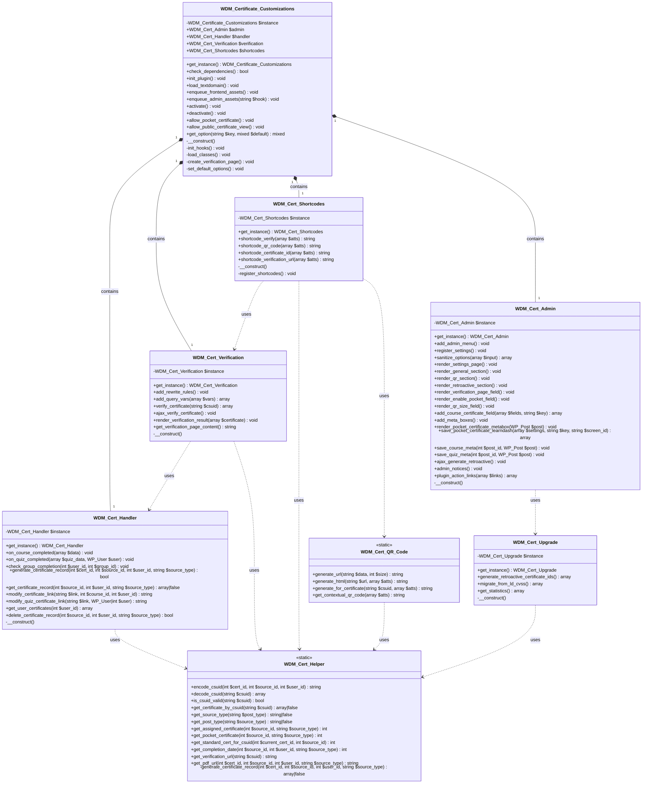
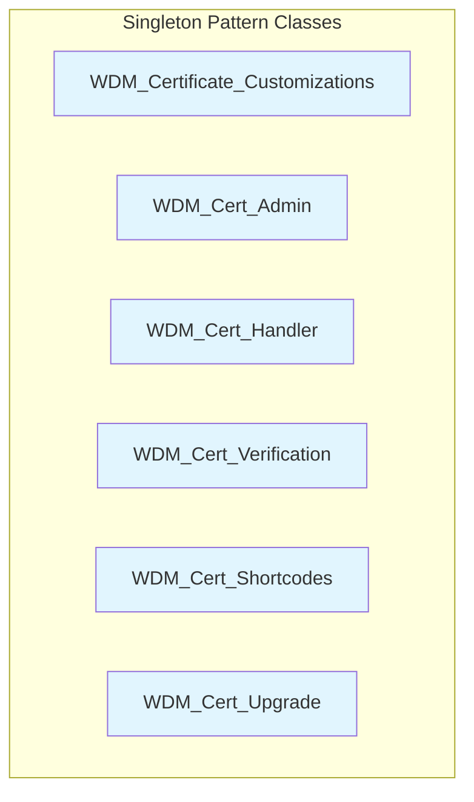
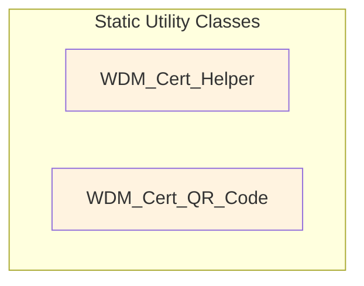
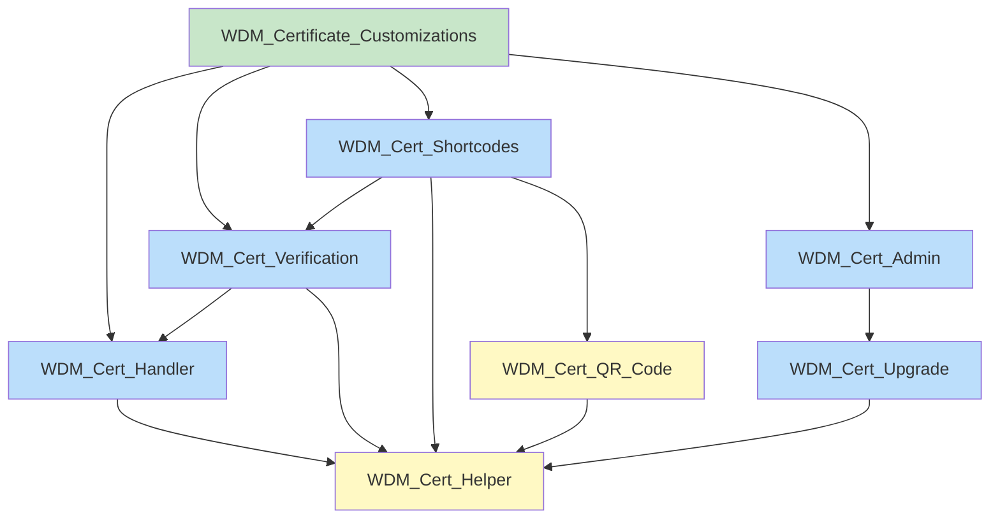

# WDM Certificate Customizations - Class Diagram

## Overview

This document provides a comprehensive class diagram showing all 8 classes in the WDM Certificate Customizations plugin, their relationships, properties, and methods.

---

## Complete Class Diagram



---

## Class Hierarchy

### Singleton Classes

The following classes implement the Singleton pattern with a private constructor and static `get_instance()` method:



### Static Utility Classes

The following classes contain only static methods:



---

## Dependency Graph



---

## Detailed Class Specifications

### 1. WDM_Certificate_Customizations

**Purpose:** Main plugin class orchestrating all components.

**Properties:**
| Property | Type | Visibility | Description |
|----------|------|------------|-------------|
| `$instance` | `WDM_Certificate_Customizations` | private static | Singleton instance |
| `$admin` | `WDM_Cert_Admin` | public | Admin component |
| `$handler` | `WDM_Cert_Handler` | public | Certificate handler |
| `$verification` | `WDM_Cert_Verification` | public | Verification component |
| `$shortcodes` | `WDM_Cert_Shortcodes` | public | Shortcodes component |

**Key Methods:**
| Method | Return Type | Description |
|--------|-------------|-------------|
| `get_instance()` | `self` | Get singleton instance |
| `check_dependencies()` | `bool` | Verify LearnDash and Certificate Builder |
| `init_plugin()` | `void` | Initialize all components |
| `allow_pocket_certificate()` | `void` | Enable pocket certificate access |
| `allow_public_certificate_view()` | `void` | Enable public verification access |
| `get_option()` | `mixed` | Get plugin option value |

---

### 2. WDM_Cert_Admin

**Purpose:** Admin interface, settings, and meta boxes.

**Key Methods:**
| Method | Return Type | Description |
|--------|-------------|-------------|
| `add_admin_menu()` | `void` | Register settings page |
| `register_settings()` | `void` | Register WordPress settings |
| `sanitize_options()` | `array` | Sanitize settings input |
| `render_settings_page()` | `void` | Render admin page HTML |
| `add_course_certificate_field()` | `array` | Add pocket cert to course settings |
| `ajax_generate_retroactive()` | `void` | AJAX handler for retroactive generation |

**WordPress Hooks:**
```php
// Actions
add_action('admin_menu', 'add_admin_menu', 100);
add_action('admin_init', 'register_settings');
add_action('save_post_sfwd-courses', 'save_course_meta');
add_action('save_post_sfwd-quiz', 'save_quiz_meta');
add_action('wp_ajax_wdm_cert_generate_retroactive', 'ajax_generate_retroactive');

// Filters
add_filter('learndash_settings_fields', 'add_course_certificate_field');
add_filter('learndash_metabox_save_fields_*', 'save_pocket_certificate_learndash');
add_filter('plugin_action_links_*', 'plugin_action_links');
```

---

### 3. WDM_Cert_Handler

**Purpose:** Certificate generation and storage.

**Key Methods:**
| Method | Return Type | Description |
|--------|-------------|-------------|
| `on_course_completed()` | `void` | Handle course completion |
| `on_quiz_completed()` | `void` | Handle quiz completion |
| `generate_certificate_record()` | `bool` | Create and store certificate record |
| `get_certificate_record()` | `array\|false` | Retrieve certificate record |
| `modify_certificate_link()` | `string` | Add CSUID to certificate links |
| `get_user_certificates()` | `array` | Get all user certificates |
| `delete_certificate_record()` | `bool` | Remove certificate record |

**WordPress Hooks:**
```php
// Actions
add_action('learndash_course_completed', 'on_course_completed');
add_action('learndash_quiz_completed', 'on_quiz_completed');
add_action('ld_added_group_access', 'check_group_completion');

// Filters
add_filter('learndash_course_certificate_link', 'modify_certificate_link', 20);
add_filter('learndash_quiz_certificate_link', 'modify_quiz_certificate_link', 20);
```

**Custom Actions Fired:**
```php
do_action('wdm_certificate_record_generated', $record, $csuid);
```

---

### 4. WDM_Cert_Verification

**Purpose:** Public certificate verification system.

**Key Methods:**
| Method | Return Type | Description |
|--------|-------------|-------------|
| `add_rewrite_rules()` | `void` | Register URL rewrite rules |
| `add_query_vars()` | `array` | Add custom query variables |
| `verify_certificate()` | `array` | Verify certificate by CSUID |
| `ajax_verify_certificate()` | `void` | AJAX handler for verification |
| `render_verification_result()` | `void` | Render verification HTML |

**WordPress Hooks:**
```php
// Actions
add_action('init', 'add_rewrite_rules');
add_action('wp_ajax_wdm_cert_verify', 'ajax_verify_certificate');
add_action('wp_ajax_nopriv_wdm_cert_verify', 'ajax_verify_certificate');

// Filters
add_filter('query_vars', 'add_query_vars');
```

**Return Structures:**

Success:
```php
array(
    'valid'       => true,
    'certificate' => array(
        'csuid'            => string,
        'recipient'        => array(...),
        'source'           => array(...),
        'standard_certificate' => array(...),
        'pocket_certificate' => array|null,
        'completion_date'  => int,
        'is_owner'         => bool,
    ),
)
```

Error:
```php
array(
    'valid'   => false,
    'error'   => string,  // Error code
    'message' => string,  // User message
)
```

---

### 5. WDM_Cert_Shortcodes

**Purpose:** Register and handle all shortcodes.

**Registered Shortcodes:**
| Shortcode | Method | Description |
|-----------|--------|-------------|
| `[wdm_certificate_verify]` | `shortcode_verify()` | Verification form and results |
| `[wdm_certificate_qr_code]` | `shortcode_qr_code()` | QR code on certificates |
| `[wdm_certificate_id]` | `shortcode_certificate_id()` | Display certificate ID |
| `[wdm_certificate_verification_url]` | `shortcode_verification_url()` | Display verification URL |

**Shortcode Attributes:**

`[wdm_certificate_verify]`:
```php
array(
    'show_form' => 'yes',  // Show search form
)
```

`[wdm_certificate_qr_code]`:
```php
array(
    'size'  => 150,              // From settings
    'align' => 'center',
    'class' => 'wdm-cert-qr-code',
)
```

`[wdm_certificate_id]`:
```php
array(
    'prefix' => '',
    'suffix' => '',
    'class'  => 'wdm-cert-id',
)
```

`[wdm_certificate_verification_url]`:
```php
array(
    'link_text' => '',      // If set, renders as link
    'class'     => '',
    'target'    => '_blank',
)
```

---

### 6. WDM_Cert_Helper

**Purpose:** Static utility methods for CSUID handling and data retrieval.

**CSUID Methods:**
| Method | Parameters | Return | Description |
|--------|------------|--------|-------------|
| `encode_csuid()` | `$cert_id, $source_id, $user_id` | `string` | Encode to hex format |
| `decode_csuid()` | `$csuid` | `array` | Decode from hex format |
| `is_csuid_valid()` | `$csuid` | `bool` | Validate format |

**Data Retrieval Methods:**
| Method | Parameters | Return | Description |
|--------|------------|--------|-------------|
| `get_certificate_by_csuid()` | `$csuid` | `array\|false` | Get certificate record |
| `get_assigned_certificate()` | `$source_id, $source_type` | `int` | Get standard cert ID |
| `get_pocket_certificate()` | `$source_id, $source_type` | `int` | Get pocket cert ID |
| `get_completion_date()` | `$source_id, $user_id, $source_type` | `int` | Get completion timestamp |

**URL Methods:**
| Method | Parameters | Return | Description |
|--------|------------|--------|-------------|
| `get_verification_url()` | `$csuid = ''` | `string` | Build verification URL |
| `get_pdf_url()` | `$cert_id, $source_id, $user_id, $source_type` | `string` | Build PDF URL |

**Type Mapping:**
| Method | Parameters | Return | Description |
|--------|------------|--------|-------------|
| `get_source_type()` | `$post_type` | `string\|false` | Post type to source type |
| `get_post_type()` | `$source_type` | `string\|false` | Source type to post type |

---

### 7. WDM_Cert_QR_Code

**Purpose:** QR code generation via QuickChart.io API.

**Methods:**
| Method | Parameters | Return | Description |
|--------|------------|--------|-------------|
| `generate_url()` | `$data, $size = 150` | `string` | Generate API URL |
| `generate_html()` | `$url, $atts = []` | `string` | Generate img tag |
| `generate_for_certificate()` | `$csuid, $atts = []` | `string` | Generate for CSUID |
| `get_contextual_qr_code()` | `$atts = []` | `string` | Context-aware generation |

**API Endpoint:**
```
https://quickchart.io/qr?text={data}&size={size}&margin=1
```

**Supported Attributes:**
```php
array(
    'size'  => 150,                    // 50-500 pixels
    'align' => '',                     // left, center, right
    'alt'   => 'Certificate QR Code',
    'class' => 'wdm-cert-qr-code',
)
```

---

### 8. WDM_Cert_Upgrade

**Purpose:** Migrations and retroactive certificate generation.

**Methods:**
| Method | Parameters | Return | Description |
|--------|------------|--------|-------------|
| `generate_retroactive_certificate_ids()` | none | `array` | Generate for historical completions |
| `migrate_from_ld_cvss()` | none | `array` | Import from LD CVSS plugin |
| `get_statistics()` | none | `array` | Get certificate statistics |

**Statistics Structure:**
```php
array(
    'total_records'    => int,
    'course_records'   => int,
    'quiz_records'     => int,
    'group_records'    => int,
    'retroactive'      => int,
    'with_pocket_cert' => int,
)
```

**Data Sources Queried:**
- `{prefix}learndash_user_activity` table
- `_sfwd-quizzes` user meta
- `learndash_group_completed_*` user meta
- `_wdm_certificate_*` user meta

---

## Type Mappings

### Post Type to Source Type

| Post Type | Source Type |
|-----------|-------------|
| `sfwd-courses` | `course` |
| `sfwd-quiz` | `quiz` |
| `groups` | `group` |

### User Meta Key Pattern

```
_wdm_certificate_{source_type}_{source_id}
```

Examples:
- `_wdm_certificate_course_123`
- `_wdm_certificate_quiz_456`
- `_wdm_certificate_group_789`

---

## Document History

| Version | Date | Author | Changes |
|---------|------|--------|---------|
| 1.0.0 | 2026-02-05 | Documentation Generator | Initial documentation |

---

*Generated from code analysis of WDM Certificate Customizations v1.0.0*
